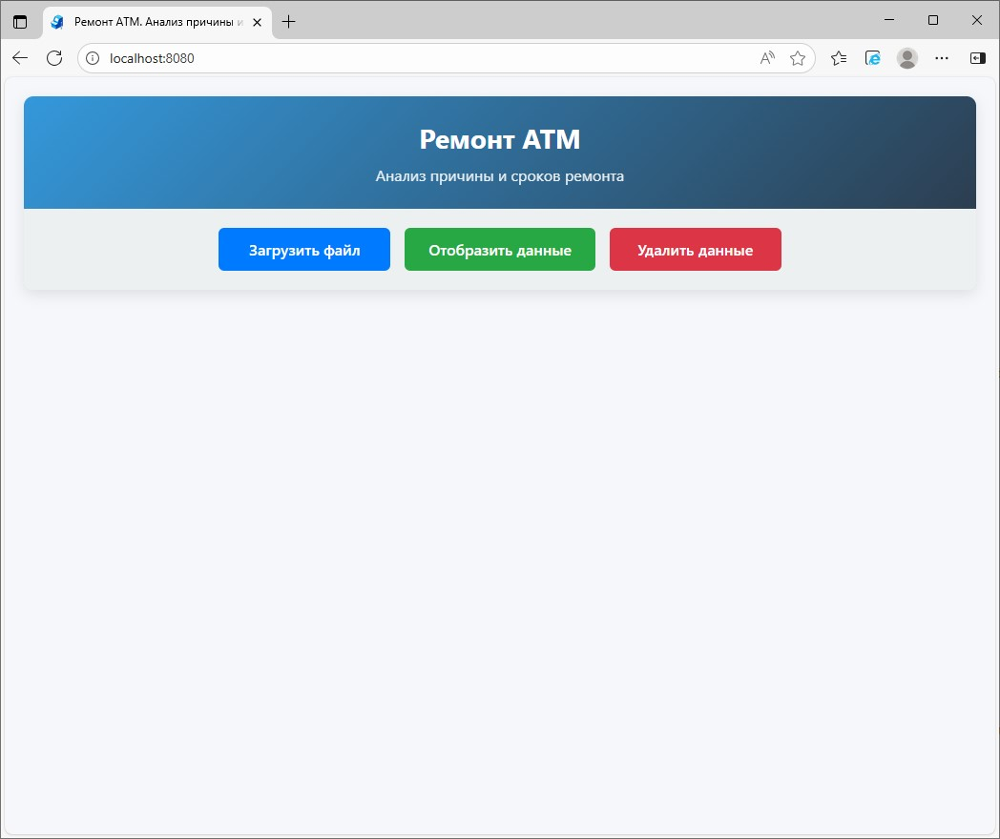
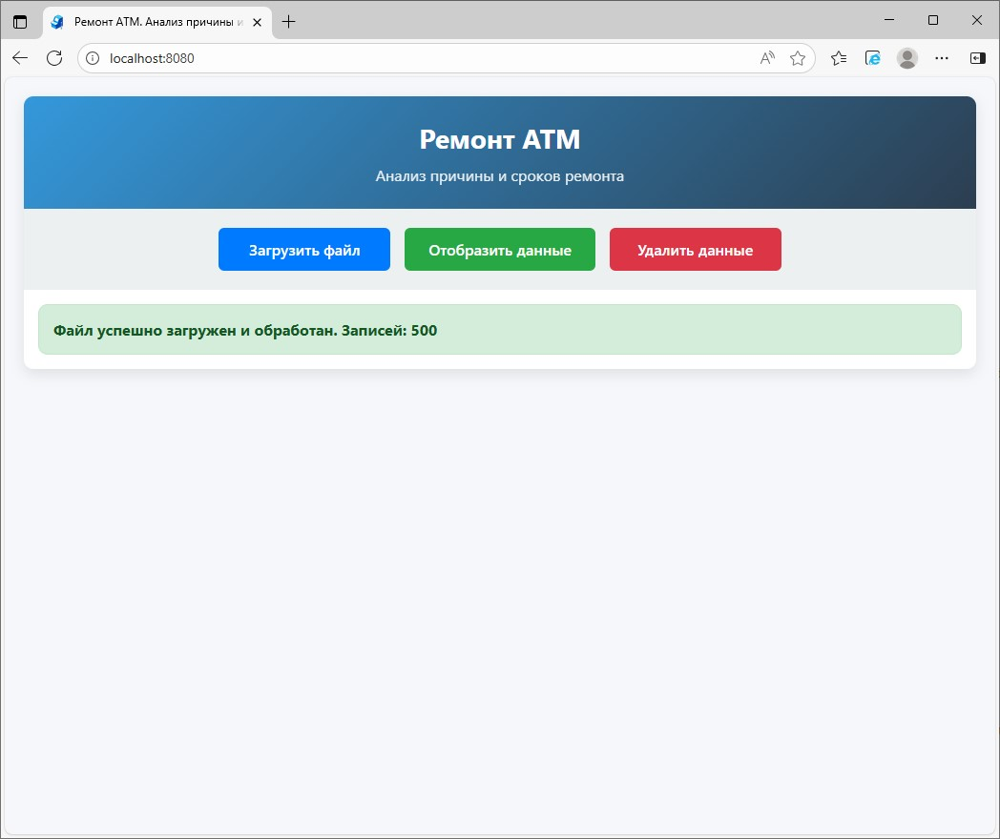
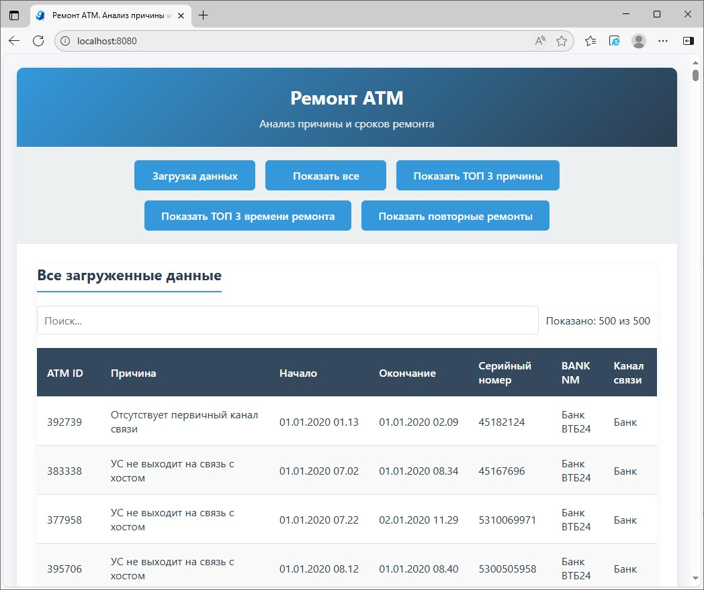
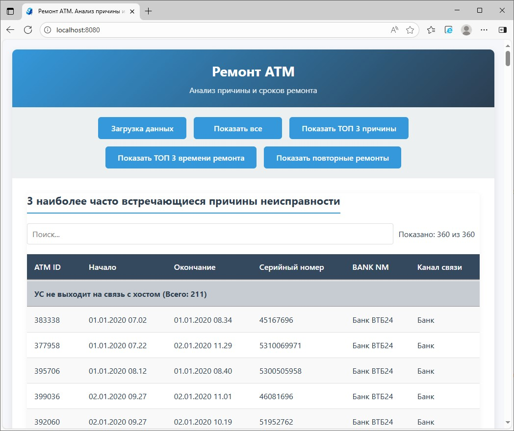
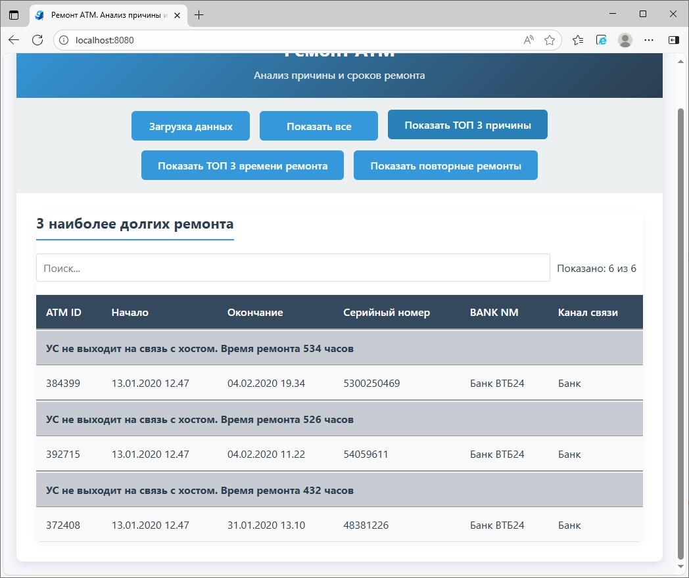
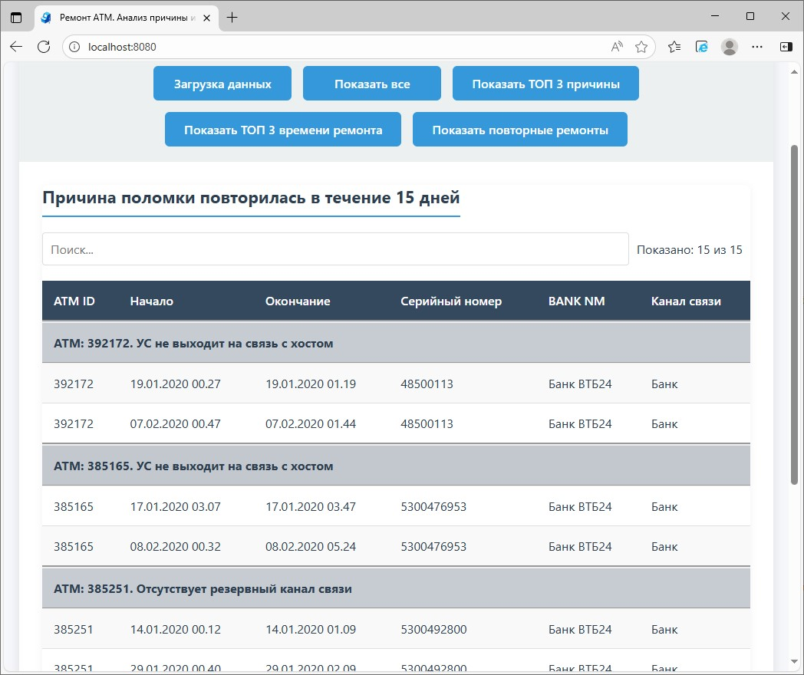
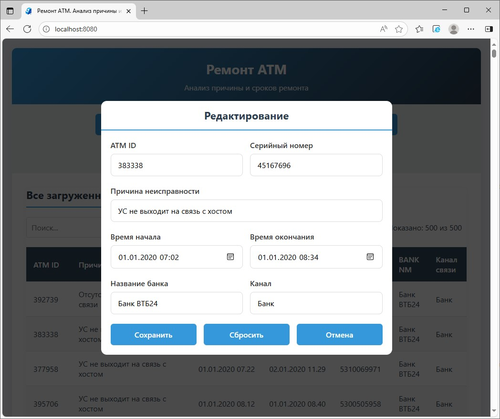

# ATM Repairs Analyzer
Ремонт АТМ. Анализ причины и сроков ремонта

Веб-приложение для анализа данных о ремонтах банкоматов с возможностью загрузки данных из Excel-файлов и различными видами аналитики.

## Функциональность

### Основные возможности:
- **Загрузка данных** из XLS/XLSX файлов
- **Просмотр всех данных** о ремонтах в табличном виде
- **Аналитика**:
  - Топ наиболее частых причин неисправностей
  - Топ самых долгих ремонтов
  - Анализ повторяющихся поломок в течение заданного периода
- **Редактирование данных** прямо в интерфейсе
- **Управление данными** (удаление всех записей)

### Технические особенности:
- **Backend**: Spring Boot приложение с REST API
- **Frontend**: Vue.js с адаптивным дизайном
- **База данных**: SQLite с JPA и Hibernate
- **Файловая обработка**: Apache POI для работы с Excel

## Структура проекта
```
src/
├── main/
│ ├── java/com/example/atmra/
│ │ ├── controller/ # REST контроллеры
│ │ ├── entity/ # JPA сущности
│ │ ├── dto/ # Data Transfer Objects
│ │ ├── repository/ # JPA репозитории
│ │ ├── service/ # Бизнес-логика
│ │ └── mapper/ # MapStruct мапперы
│ ├── resources/
│ │ └── static/ # Статические ресурсы (CSS, JS)
│ └── application.properties # Конфигурация
```

## API Endpoints

### Основные endpoints:
- `GET /api/incidents/data/{type}` - получение данных по типу
- `POST /api/incidents/update` - обновление записи
- `POST /api/incidents/upload` - загрузка файла
- `GET /api/incidents/deleteAll` - удаление всех данных
- `GET /config.js` - конфигурация для фронтенда

### Типы данных:
- `allData` - все данные
- `mostCommonCauses` - частые причины
- `longestRepairTimes` - долгие ремонты
- `causeFailureRecurred` - повторные поломки

## Требования

### Системные требования:
- Java 21+
- Maven 3.6+
- Современный браузер с поддержкой ES6+

### Зависимости:
- Spring Boot 3.5.5
- SQLite 3.49.1.0
- Hibernate 6.6.26
- Apache POI 5.4.1
- MapStruct 1.6.3
- Lombok 1.18.38
- Vue.js 3.5.21

## Установка и запуск

### Клонирование репозитория
```bash
git clone https://github.com/ilych2000/atm-repairs-analyzer.git
cd atm-incidents-analyzer
```
### Сборка проекта
```bash
mvn clean package
```
### Запуск приложения из Maven
```bash
mvn spring-boot:run
```
### Запуск приложения jar
```bash
java -jar atm-repairs-analyzer-0.0.1-SNAPSHOT.jar
```
### Запуск приложения jar на определенном порту
```bash
java -jar atm-repairs-analyzer-0.0.1-SNAPSHOT.jar -Dserver.port=9090
```

### Доступ к приложению
```bash
Откройте в браузере: http://localhost:8080
```

## Конфигурация
### Настройки в application.properties:
#### Количество записей для аналитики
```bash
# Количество наиболее часто встречающихся причин неисправности
atm-repairs-analizer.count-top-most-common-causes=3

# Количество наиболее долгих ремонта
atm-repairs-analizer.count-longest-repair-times=3

# Количество дней за которые причина поломки повторилась
atm-repairs-analizer.count-cause-failure-recurred=15
```
#### Порт сервера
```bash
server.port=8080
```
### Настройки базы данных в application.yml:
```yaml
spring:
  datasource:
    url: jdbc:sqlite:db.sqlite
  jpa:
    hibernate:
      ddl-auto: update
```
## Скриншоты
### Страница загрузки данных

### Страница загрузки данных после успешного импорта XLS файла

### Страница Все загруженные данные

### Страница 3 наиболее часто встречающиеся причины неисправности

### Страница 3 наиболее долгих ремонта

### Страница Причина поломки повторилась в течение 15 дней

### Страница с диалогом редактирования данных ремонта

